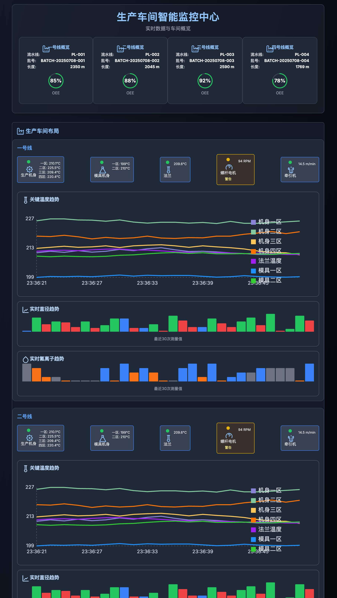

# KMF SCADA

基于FastAPI的SCADA系统后端API，采用最佳实践架构设计，使用Supabase进行用户认证和管理。



## 架构概览

```
┌─────────────┐    ┌─────────────┐    ┌─────────────┐    ┌─────────────┐
│  PC Browser │    │     Kong    │    │   FastAPI   │    │   Supabase  │
│             │───▶│  API Gateway│───▶│   Backend   │───▶│    Auth     │
│  Mobile     │    │  Port 8000  │    │  Port 8080  │    │  Port 9999  │
└─────────────┘    └─────────────┘    └─────────────┘    └─────────────┘
                           │                   │                   │
                           ▼                   ▼                   ▼
                    ┌─────────────┐    ┌─────────────┐    ┌─────────────┐
                    │   Frontend  │    │   Database  │    │   Database  │
                    │   (Next.js) │    │ (PostgreSQL)│    │ (PostgreSQL)│
                    │  Port 3000  │    │  Port 5432  │    │  Port 5432  │
                    └─────────────┘    └─────────────┘    └─────────────┘
```

## 完整系统架构

```
┌─────────────────────────────────────────────────────────────────────────────┐
│                             外部访问层                                      │
│  ┌─────────────┐  ┌─────────────┐  ┌─────────────┐  ┌─────────────┐     │
│  │  PC Browser │  │   Mobile    │  │   API Client│  │   Dashboard │     │
│  │             │  │   App       │  │             │  │   (Studio)  │     │
│  └─────────────┘  └─────────────┘  └─────────────┘  └─────────────┘     │
└─────────────────────────────────────────────────────────────────────────────┘
                                    │
                                    ▼
┌─────────────────────────────────────────────────────────────────────────────┐
│                           Kong API Gateway (8000)                          │
│  ┌─────────────────────────────────────────────────────────────────────┐   │
│  │ 路由配置:                                                          │   │
│  │ • /              → Frontend UI (3000)                             │   │
  │  │ • /api/v1/*      → FastAPI Backend (8080)                        │   │
│  │ • /auth/v1/*     → Supabase Auth (9999)                          │   │
│  │ • /rest/v1/*     → PostgREST (3000)                              │   │
│  │ • /storage/v1/*  → Storage API (5000)                            │   │
│  │ • /functions/v1/*→ Edge Functions (9000)                         │   │
│  │ • /realtime/v1/* → Realtime (4000)                               │   │
│  │ • /pg/*          → pg-meta (8080)                                │   │
│  │ • /analytics/v1/*→ Analytics (4000)                              │   │
│  └─────────────────────────────────────────────────────────────────────┘   │
└─────────────────────────────────────────────────────────────────────────────┘
                                    │
                    ┌───────────────┼───────────────┐
                    ▼               ▼               ▼
┌─────────────┐ ┌─────────────┐ ┌─────────────┐ ┌─────────────┐
│  Frontend   │ │  FastAPI    │ │  Supabase   │ │  Supabase   │
│  (Next.js)  │ │  Backend    │ │   Auth      │ │   Studio    │
│  Port 3000  │ │  Port 8000  │ │  Port 9999  │ │  Port 3000  │
└─────────────┘ └─────────────┘ └─────────────┘ └─────────────┘
       │               │               │               │
       └───────────────┼───────────────┼───────────────┘
                       ▼               ▼
┌─────────────────────────────────────────────────────────────────────────────┐
│                          数据服务层                                        │
│  ┌─────────────┐  ┌─────────────┐  ┌─────────────┐  ┌─────────────┐     │
│  │ PostgREST   │  │  Realtime   │  │   Storage   │  │  Analytics  │     │
│  │ Port 3000   │  │  Port 4000  │  │  Port 5000  │  │  Port 4000  │     │
│  └─────────────┘  └─────────────┘  └─────────────┘  └─────────────┘     │
└─────────────────────────────────────────────────────────────────────────────┘
                                    │
                                    ▼
┌─────────────────────────────────────────────────────────────────────────────┐
│                          存储层                                           │
│  ┌─────────────┐  ┌─────────────┐  ┌─────────────┐  ┌─────────────┐     │
│  │ PostgreSQL  │  │   MinIO     │  │  Edge Funcs │  │   Pooler    │     │
│  │ Port 5432   │  │ Port 9000   │  │  Port 9000  │  │  Port 6543  │     │
│  │ (主数据库)   │  │ (对象存储)   │  │ (无服务器)   │  │ (连接池)    │     │
│  └─────────────┘  └─────────────┘  └─────────────┘  └─────────────┘     │
└─────────────────────────────────────────────────────────────────────────────┘
```

## 服务详细说明

### 1. Kong API Gateway (端口 8000)
- **作用**: 统一入口点，处理路由、CORS、认证、限流
- **路由配置**:
  - `/`              → Frontend UI (3000)
  - `/api/v1/*`      → FastAPI Backend (8000)
  - `/auth/v1/*`     → Supabase Auth (9999)
  - `/rest/v1/*`     → PostgREST (3000)
  - `/storage/v1/*`  → Storage API (5000)
  - `/functions/v1/*`→ Edge Functions (9000)
  - `/realtime/v1/*` → Realtime (4000)
  - `/pg/*`          → pg-meta (8080)
  - `/analytics/v1/*`→ Analytics (4000)
- **插件**: CORS, Key Auth, ACL, Basic Auth, Request Transformer

### 2. Frontend (Next.js)
- **端口**: 3000 (内部)
- **访问**: 通过 Kong 在 8000 端口
- **功能**: 用户界面、认证、仪表板
- **技术栈**: Next.js 15, TypeScript, Tailwind CSS
- **认证**: 直接使用 Supabase Auth

### 3. FastAPI Backend
- **端口**: 8080 (内部)
- **访问**: 通过 Kong 在 `/api/v1/` 路径
- **功能**: 业务逻辑、生产数据管理
- **认证**: 验证 Supabase JWT Token
- **用户管理**: 通过 Supabase Auth API

### 4. Supabase 核心服务

#### 4.1 Supabase Auth (端口 9999)
- **功能**: 用户认证、JWT 令牌管理、用户管理
- **数据库**: 共享 PostgreSQL

#### 4.2 PostgREST (端口 3000)
- **功能**: 自动生成 REST API
- **数据库**: 直接访问 PostgreSQL

#### 4.3 Realtime (端口 4000)
- **功能**: 实时数据同步
- **协议**: WebSocket + HTTP

#### 4.4 Storage API (端口 5000)
- **功能**: 文件存储管理
- **后端**: MinIO 对象存储

#### 4.5 Edge Functions (端口 9000)
- **功能**: 无服务器函数
- **运行时**: Deno

#### 4.6 Analytics (端口 4000)
- **功能**: 数据分析和日志
- **后端**: Logflare

#### 4.7 pg-meta (端口 8080)
- **功能**: 数据库元数据管理
- **用途**: Studio 数据库管理

#### 4.8 Supabase Studio (端口 3000)
- **功能**: 管理界面
- **访问**: 通过 Kong 在 `/` 路径

### 5. 存储服务

#### 5.1 PostgreSQL Database (端口 5432)
- **作用**: 主数据库，存储所有业务数据
- **用户数据**: 由 Supabase Auth 管理
- **业务数据**: 生产数据、配置等

#### 5.2 MinIO (端口 9000/9001)
- **作用**: 对象存储服务
- **功能**: 文件上传、下载、管理
- **控制台**: 端口 9001

#### 5.3 Pooler (端口 6543)
- **作用**: 数据库连接池
- **功能**: 优化数据库连接管理

### 6. 网络配置
- **外部网络**: `zxnet` (Docker external network)
- **内部通信**: 所有服务通过 Docker 网络通信
- **端口暴露**: 仅 Kong (8000) 和 MinIO (9000/9001) 对外暴露

## 统一访问架构

**所有服务都通过 Kong API Gateway 访问：**

- **前端访问**: `http://localhost:8000/` → Kong → Frontend (3000)
- **API访问**: `http://localhost:8000/api/v1/` → Kong → FastAPI (8080)
- **认证访问**: `http://localhost:8000/auth/v1/` → Kong → Supabase Auth (9999)
- **数据库API**: `http://localhost:8000/rest/v1/` → Kong → PostgREST (3000)
- **文件存储**: `http://localhost:8000/storage/v1/` → Kong → Storage API (5000)
- **实时数据**: `http://localhost:8000/realtime/v1/` → Kong → Realtime (4000)
- **无服务器**: `http://localhost:8000/functions/v1/` → Kong → Edge Functions (9000)
- **管理界面**: `http://localhost:8000/` → Kong → Studio (3000)

## 快速开始

### 1. 环境配置
```bash
# 复制环境变量文件
cp .env.example .env

# 编辑环境变量
vim .env
```

### 2. 数据库设置

```bash
# 初始化数据库迁移
alembic init alembic

# 创建初始迁移
alembic revision --autogenerate -m "Initial migration"

# 执行迁移
alembic upgrade head
```

### 3. 运行应用

```bash
# 开发模式
uvicorn main:app --reload --host 0.0.0.0 --port 8000

# 或使用make
make dev
```

## API文档

启动应用后，访问以下地址查看API文档：

- Swagger UI: http://localhost:8000/docs
- ReDoc: http://localhost:8000/redoc

## 开发指南

### 代码风格

项目使用以下工具确保代码质量：

- **Black**: 代码格式化
- **isort**: import排序
- **flake8**: 代码检查
- **mypy**: 类型检查

```bash
# 格式化代码
black app
isort app

# 检查代码质量
flake8 app
mypy app
```

### 添加新功能

1. **创建模型**: 在`app/models/`中添加SQLAlchemy模型
2. **创建模式**: 在`app/schemas/`中添加Pydantic模式
3. **创建CRUD**: 在`app/crud/`中添加CRUD操作
4. **创建端点**: 在`app/api/v1/endpoints/`中添加API端点

### 数据库迁移

```bash
# 创建新迁移
alembic revision --autogenerate -m "Description"

# 应用迁移
alembic upgrade head

# 回滚迁移
alembic downgrade -1
```

## 用户认证

### Supabase 认证流程

1. **用户注册**: 通过 Supabase Auth API
2. **用户登录**: 获取 JWT Token
3. **API 访问**: 使用 JWT Token 进行认证
4. **用户管理**: 通过 Supabase Admin API

### 认证端点

- `POST /api/v1/auth/signup` - 用户注册
- `POST /api/v1/auth/signin` - 用户登录
- `POST /api/v1/auth/signout` - 用户登出
- `GET /api/v1/auth/me` - 获取当前用户信息
- `PUT /api/v1/auth/profile` - 更新用户资料

## 部署

### Docker部署

```bash
# 构建镜像
docker build -t kmfscada .

# 运行容器
docker run -p 8000:8000 kmfscada

# 使用Docker Compose
docker compose -f docker-compose.scada.yml up -d
```

### 生产环境

1. 设置环境变量
2. 配置数据库连接
3. 配置 Supabase 连接
4. 运行数据库迁移
5. 启动应用

```bash
# 生产模式启动
uvicorn main:app --host 0.0.0.0 --port 8000 --workers 4
```

## 注意事项

- 用户认证完全由 Supabase 管理
- 本地数据库只存储业务数据（生产数据等）
- 所有用户相关的操作都通过 Supabase Auth API
- JWT Token 由 Supabase 生成和验证
